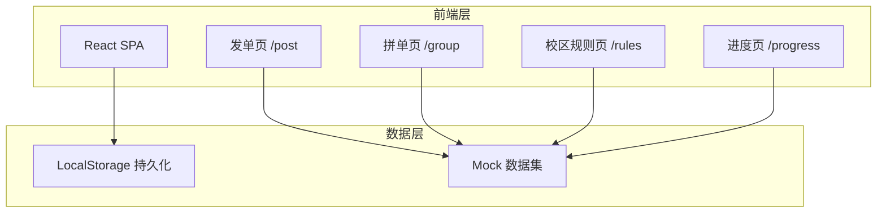
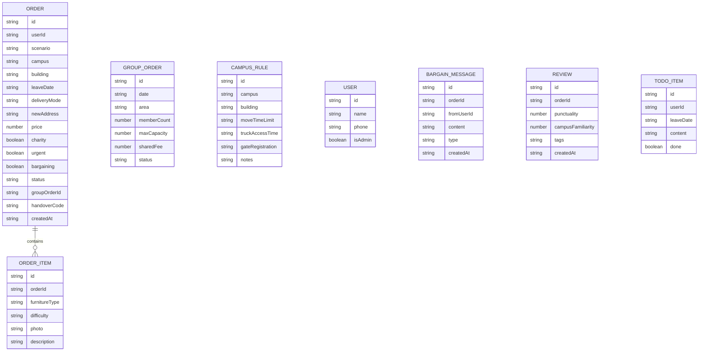

## 1. 架构设计



纯前端架构，无后端服务。使用 LocalStorage 模拟数据持久化，内置 Mock 数据集提供校区规则、宿舍楼信息等预设内容。

## 2. 技术说明

- **前端框架**：React@18 + TypeScript
- **样式方案**：Tailwind CSS@3
- **构建工具**：Vite
- **路由方案**：React Router v6
- **状态管理**：React Context + useReducer
- **动画库**：Framer Motion
- **后端服务**：无（纯前端，LocalStorage 持久化）
- **数据库**：无（Mock 数据 + LocalStorage）

## 3. 路由定义

| 路由 | 用途 |
|------|------|
| / | 应用首页，重定向至发单页 |
| /post | 发单页：发起家具转手需求 |
| /group | 拼单页：按日期片区聚合拼车 |
| /rules | 校区规则页：搬运规则速查 |
| /progress | 进度页：订单追踪、交接码、待办、评价 |

## 4. 数据模型

### 4.1 数据模型定义



### 4.2 核心数据结构（TypeScript）

```typescript
type Scenario = "same_school" | "off_campus" | "recycle"
type DeliveryMode = "self_pickup" | "deliver"
type Difficulty = "easy" | "medium" | "hard"
type OrderStatus = "pending" | "grouped" | "delivering" | "completed"
type GroupStatus = "forming" | "confirmed" | "delivering" | "completed"

interface Order {
  id: string
  userId: string
  scenario: Scenario
  campus: string
  building: string
  leaveDate: string
  deliveryMode: DeliveryMode
  newAddress?: string
  price: number
  charity: boolean
  urgent: boolean
  bargaining: boolean
  status: OrderStatus
  groupOrderId?: string
  handoverCode: string
  createdAt: string
  items: OrderItem[]
}

interface OrderItem {
  id: string
  orderId: string
  furnitureType: string
  difficulty: Difficulty
  photo?: string
  description: string
}

interface GroupOrder {
  id: string
  date: string
  area: string
  memberCount: number
  maxCapacity: number
  sharedFee: number
  status: GroupStatus
  orderIds: string[]
}

interface CampusRule {
  id: string
  campus: string
  building: string
  moveTimeLimit: string
  truckAccessTime: string
  gateRegistration: string
  notes: string
}

interface User {
  id: string
  name: string
  phone: string
  isAdmin: boolean
}

interface BargainMessage {
  id: string
  orderId: string
  fromUserId: string
  content: string
  type: "offer" | "accept" | "reject"
  createdAt: string
}

interface Review {
  id: string
  orderId: string
  punctuality: number
  campusFamiliarity: number
  tags: string[]
  createdAt: string
}

interface TodoItem {
  id: string
  userId: string
  leaveDate: string
  content: string
  done: boolean
}
```

## 5. Mock 数据说明

应用内置以下 Mock 数据，无需外部 API：

- **校区数据**：3个校区，每个校区5-8栋宿舍楼
- **校区规则数据**：每栋楼对应搬运时间限制、货车通行时段、门岗登记要求
- **家具类型**：桌子、椅子、床垫、书柜、上床下桌、组合柜、铁架床、衣柜、其他
- **拆装难度映射**：上床下桌→难、组合柜→难、铁架床→中、普通桌椅→易
- **预设拼单**：2-3条示例拼单数据
- **预设订单**：5-8条各状态示例订单
- **预设待办**：离校当天标准待办模板
